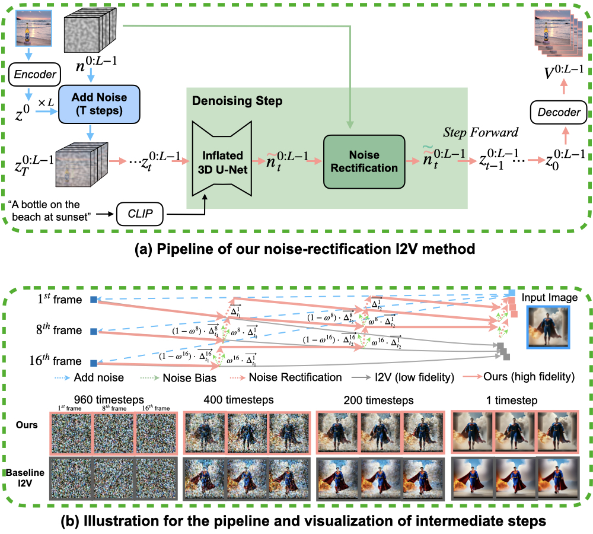

# Tuning-Free Noise Rectification for High Fidelity Image-to-Video Generation

<a href='https://arxiv.org/abs/2403.02827'></a> <a href='https://noise-rectification.github.io/'></a> <a href='https://github.com/alimama-creative/Noise-Rectification'></a>

Noise Rectification is a simple but effective method for image-to-video generation in open domains, and is tuning-free and plug-and-play.
<p align="center">
  
</p>

## Core code
Our I2V gneration is based on the recent T2V work [AnimateDiff](https://github.com/guoyww/AnimateDiff) and test on the **AnimateDiff v1** version. Here we provide the core code of our implementation.

1. Prepare the environment and download the required weights in the AnimateDiff.
2. Place the following script `pipeline_I2V_noise_rectification.py` under the `pipelines` folder.

> Note: To achieve better results, you could adjust the input image and prompt, and noise rectification parameters (noise_rectification_period and noise_rectification_weight).

```python
## Core Code Explanation in the pipeline_I2V_noise_rectification.py

## Add noise to the input image, see the function: prepare_latents(**kwargs)
def prepare_latents(input_image, **kwargs):
    #########################
    # Omit: Code for sampling noise ..
    #########################

    # Add noise to input image
    noise = latents.clone()
    if input_image is not None:
        input_image = preprocess_image(input_image, width, height)
        input_image = input_image.to(device=device, dtype=dtype)

        if isinstance(generator, list):
            init_latents = [
                self.vae.encode(input_image[i : i + 1]).latent_dist.sample(generator[i]) for i in range(batch_size)
            ]
            init_latents = torch.cat(init_latents, dim=0)
        else:
            init_latents = self.vae.encode(input_image).latent_dist.sample(generator)
    else:
        init_latents = None

    if init_latents is not None:
        init_latents = rearrange(init_latents, '(b f) c h w -> b c f h w', b = batch_size, f = 1)
        init_latents = init_latents.repeat((1, 1, video_length, 1, 1)) * 0.18215
        noisy_latents = self.scheduler.add_noise(init_latents, noise, self.scheduler.timesteps[0])
    
    return noisy_latents, noise

## Denoising from the noisy_latents and take noise rectification.
def __call__(kwargs):
    #########################
    # Omit: Code for preprocessing inputs check, prompt, timesteps, and other preparation...
    #########################

    # denoising loop
    for i in timesteps:
        # Omit: other codes ...

        # predict the noise residual
        noise_pred = self.unet(
            latent_model_input, t, 
            encoder_hidden_states=text_embeddings,
            down_block_additional_residuals = None,
            mid_block_additional_residual   = None,
        ).sample.to(dtype=latents_dtype)

        # [The core code of our method.]
        # our method rectifies the predicted noise with the GT noise to realize image-to-video.
        if noise_rectification_period is not None:
            assert len(noise_rectification_period) == 2
            if noise_rectification_weight is None:
                noise_rectification_weight = torch.cat([torch.linspace(noise_rectification_weight_start_omega, noise_rectification_weight_end_omega, video_length//2), 
                                                        torch.linspace(noise_rectification_weight_end_omega, noise_rectification_weight_end_omega, video_length//2)])
            noise_rectification_weight = noise_rectification_weight.view(1, 1, video_length, 1, 1)
            noise_rectification_weight = noise_rectification_weight.to(latent_model_input.dtype).to(latent_model_input.device)

            if i >= len(timesteps) * noise_rectification_period[0] and i < len(timesteps) * noise_rectification_period[1]:
                delta_frames = noise - noise_pred
                delta_noise_adjust = noise_rectification_weight * (delta_frames[:,:,[0],:,:].repeat((1, 1, video_length, 1, 1))) + \
                                    (1 - noise_rectification_weight) * delta_frames
                noise_pred = noise_pred + delta_noise_adjust

        # compute the previous noisy sample x_t -> x_t-1
        noisy_latents = self.scheduler.step(noise_pred, t, noisy_latents, **extra_step_kwargs).prev_sample

```


## Citation

If this repo is useful to you, please cite our paper.

```bibtex
@article{li2024tuningfree,
      title={Tuning-Free Noise Rectification for High Fidelity Image-to-Video Generation}, 
      author={Weijie Li and Litong Gong and Yiran Zhu and Fanda Fan and Biao Wang and Tiezheng Ge and Bo Zheng},
      year={2024},
      eprint={2403.02827},
      archivePrefix={arXiv},
      primaryClass={cs.CV}
}
```
## Contact Us

Please feel free to reach out to us:

- Email: [weijie.lwj0@alibaba-inc.com](mailto:weijie.lwj0@alibaba-inc.com)

## **Acknowledgement**
This repository is benefit from [AnimateDiff](https://github.com/guoyww/AnimateDiff). Thanks for the open-sourcing work! Any third-party packages are owned by their respective authors and must be used under their respective licenses.
